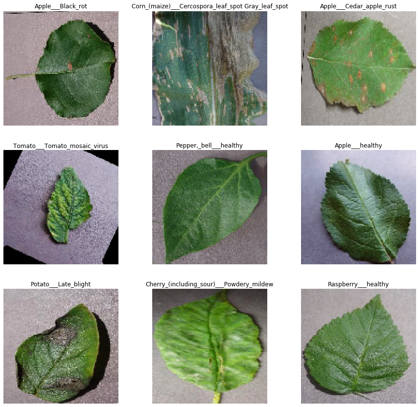

# Plant Leaf Disease Classification using PyTorch

## Abstract
In this study, a model has been developed to classify plant diseases using leaf images of healthy and diseased plants.
PyTorch was used to develop the model and the dataset used was PlantVillage (kaggle) dataset(<https://www.kaggle.com/vipoooool/new-plant-diseases-dataset>). The EfficientNet-b3 was the architecture used. 
  
We have used EfficientNet-b3 as our base model. To train this model, we used Pytorch, images from kaggle. We have used EarlyStopping callback to stop training when the validation loss is getting worse

The classifer can classify on the following 38 classes:
1. Apple -- Apple Scab
2. Apple -- Black Rot
3. Apple -- Cedar Apple Rust
4. Apple -- Healthy
5. Cherry -- Powdery Mildew
6. Cherry -- Healthy
7. Corn -- Gray Leaf Spot (Cercospora Leaf Spot)
8. Corn -- Common Rust
9. Corn -- Northern Leaf Blight
10. Corn -- Healthy
11. Grape -- Black Rot
12. Grape -- Esca (Black Measles)
13. Grape -- Leaf Blight (Isariopsis Leaf Spot)
14. Grape -- Healthy
15. Peach -- Bacterial_spot
16. Peach -- Healthy
17. Pepper Bell -- Bacterial Spot
18. Pepper Bell -- Healthy
19. Potato -- Early Blight
20. Potato -- Late Blight
21. Potato -- Healthy
22. Strawberry -- Leaf Scorch
23. Strawberry -- Healthy
24. Tomato -- Bacterial Spot
25. Tomato -- Early Blight
26. Tomato -- Late Blight
27. Tomato -- Leaf Mold
28. Tomato -- Septoria Leaf Spot
29. Tomato -- Two-spotted Spider Mites
30. Tomato -- Target Spot
31. Tomato -- Yellow Leaf Curl Virus
32. Tomato -- Mosaic Virus
33. Tomato -- Healthy

## Methodology
#### Dataset Description
We used 70295 images of plant leaves for training the model, 17572 images for validation and tested on 33 images.

    Sample dataset
  

#### Model Description
We used a pretrained CNN model called EfficientNet-b3 for training (a.k.a transfer learning)(Image Size: 256 x 256 pixels).

#### Tech Stack 
* Pytorch

#### Performance
We ran our experiment on train-validation set 80-20 split(80% of the whole dataset used for training, and 20% for validation). We compute the mean precision, mean recall, mean F1 score, along with the overall accuracy.

We got the following metrics:

    Confusion Matrix
  

* Mean Precision - 99.568%
* Mean Recall - 99.575%
* Mean F1 score - 99.571%
* Overall Accuracy - 99.579%

## Summary
To summarize,
1. Choice of deep learning architecture: EfficientNet-b3.
3. Choice of training-testing set distribution:
Train: 80%, Validation: 20%

## Resources
Dataset: <https://www.kaggle.com/vipoooool/new-plant-diseases-dataset> 
