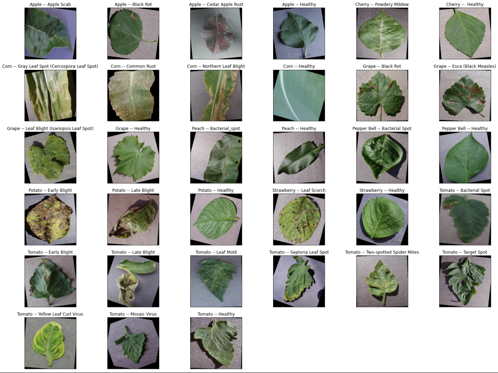

# Plant Leaf Disease Classification using PyTorch

## Abstract
In this study, a model was developed for the classification of plant leaf diseases from the leaf images using EfficientNet B3 deep learning architecture. The datasets having 60930 images was used to train the models using transfer learning approach. The results of the study showed that the model achieved 99.875%, 99.871% and 99.874% accuracy, recall and precision, respectively. A web application was developed where the user can upload the leaf image and predict the disease. (Try out: https://gauthamsree.github.io/Plant-Leaf-Disease-Classification, [Expect delay: since backend is deployed on Render(free tier)])

## Run Web App Locally
Running locally with docker-compose, instant respose from the backend is possible(rather than waiting in case of Render (free tier)). Make sure you have installed Docker, docker-compose, and started docker engine.

Step 1: 
  * Clone this Repo and `cd` into the folder
  * Code: `git clone https://github.com/GauthamSree/Plant-Leaf-Disease-Classification.git`

Step 2:
  * Run the following command to build the frontend and backend images run the web app with Docker Compose
  * Code: `docker-compose up --build -d` 

Step 3: 
  * Goto http://localhost:3000/Plant-Leaf-Disease-Classification in your browser for interacting with the web app 

Step 4: 
  * Run the following command to stop the docker containers
  * Code: `docker-compose down` 

For deleting the Whole Web App 
Step 1: 
  * Deleting the docker containers
  * Code: `docker rmi $(docker ps -a |  grep "plant-leaf-disease-classification_" | awk '{print $1}')` 

Step 2: 
  * Deleting the docker images
  * Code: `docker rmi $(docker images -a |  grep "plant-leaf-disease-classification_" | awk '{print $3}')` 

Step 3: 
  * Delete the cloned folder.

## Method
PlantVillage dataset contains 38 classes and 70295 images of 14 different plant species in total, 12 of which are healthy, 26 of which are diseased. In the present study, dataset of 9 plant species which have both healthy and diseased leaf images was used for training the model with transfer learning technique. The total number of images was 60930 for training and 15231 for validation. Augmentation method was applied to the dataset while training, to obtain different images for the diseases in each epoch.  
The classifer can classify on the following 33 classes:
1. Apple -- Apple Scab
2. Apple -- Black Rot
3. Apple -- Cedar Apple Rust
4. Apple -- Healthy
5. Cherry -- Powdery Mildew
6. Cherry -- Healthy
7. Corn -- Gray Leaf Spot (Cercospora Leaf Spot)
8. Corn -- Common Rust
9. Corn -- Northern Leaf Blight
10. Corn -- Healthy
11. Grape -- Black Rot
12. Grape -- Esca (Black Measles)
13. Grape -- Leaf Blight (Isariopsis Leaf Spot)
14. Grape -- Healthy
15. Peach -- Bacterial_spot
16. Peach -- Healthy
17. Pepper Bell -- Bacterial Spot
18. Pepper Bell -- Healthy
19. Potato -- Early Blight
20. Potato -- Late Blight
21. Potato -- Healthy
22. Strawberry -- Leaf Scorch
23. Strawberry -- Healthy
24. Tomato -- Bacterial Spot
25. Tomato -- Early Blight
26. Tomato -- Late Blight
27. Tomato -- Leaf Mold
28. Tomato -- Septoria Leaf Spot
29. Tomato -- Two-spotted Spider Mites
30. Tomato -- Target Spot
31. Tomato -- Yellow Leaf Curl Virus
32. Tomato -- Mosaic Virus
33. Tomato -- Healthy

    Sample Train Dataset
  

The augmentation techniques included random horizontal flip, vertical flip, rotation, cutout, etc. EfficientNet B3 architecture was the body of the newly developed model, while the head architecture of the model was custom made.  
For training the model, cross entropy loss function and Adam optimizer with a learning rate of 3E-4 and Cosine Annealing Warm Restarts scheduler were used. The batch size was set to 32.
The training was done using the mixed precision functionality in PyTorch (torch.cuda.amp.GradScaler). The gradient scaling multiplies the network’s losses by a scale factor which helps to prevent underflow. Early Stopping callback was used to avoid overfitting of the model, which monitors performance of the loss value on validation split.
A web application was developed to utilize the model which can be accessed by the end users. The Backend (RestAPI) of the website was developed using python library FastAPI and front end by ReactJS. 
 

## Tech Stack
* Pytorch
* ReactJS
* FastAPI
* Render
* GitHub Pages
* Docker & Docker Compose

## Results
A model was developed for the classification of plant leaf diseases using EfficientNet B3 deep learning architecture. The results of the study showed that the model achieved 99.875%, 99.871% and 99.874% accuracy, recall and precision, respectively. 

    Confusion Matrix
  

The user can upload leaf images on the website to predict the plant disease using this model. Sample image can also be viewed and predicted. 

## Resources
Dataset: <https://www.kaggle.com/vipoooool/new-plant-diseases-dataset> 
