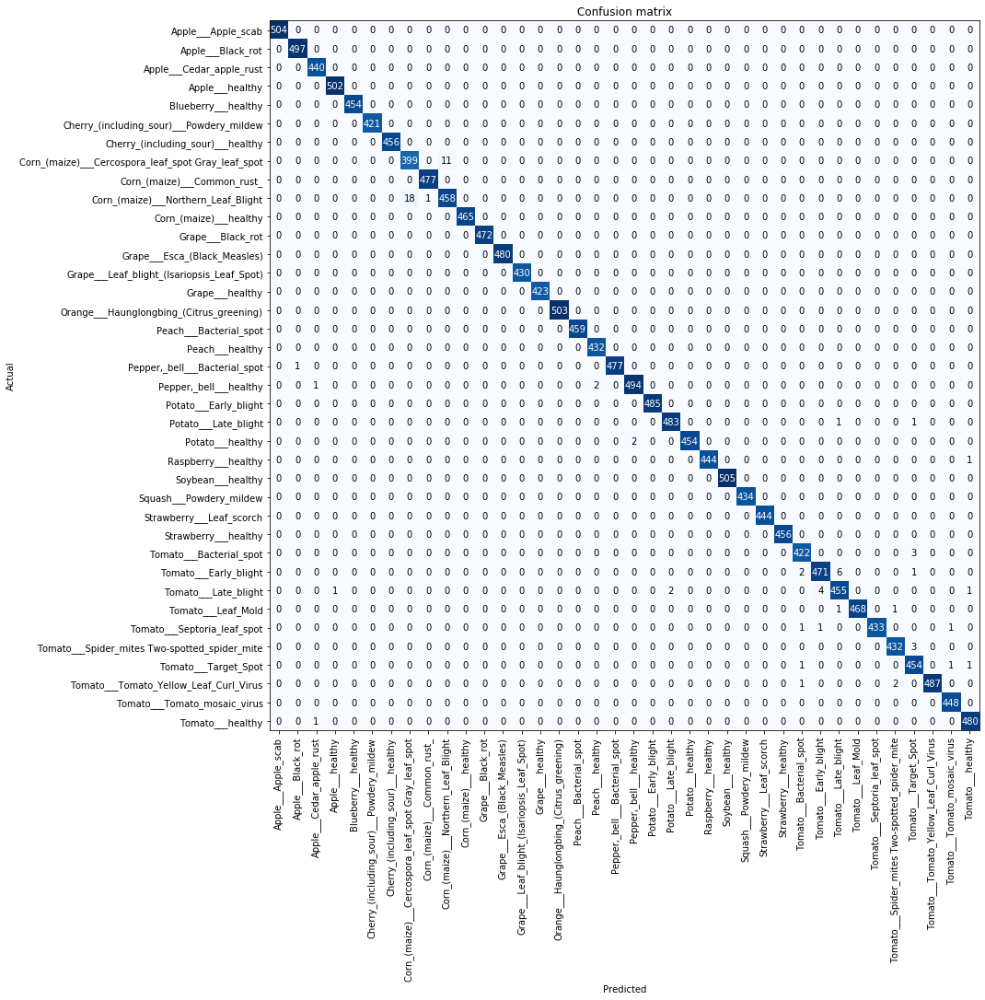

# Plant Disease Classification using Transfer Learning

Plant disease classification model is made using fastai vision module. The classification is based on the leaf images. 

The classifer can classify on the following 38 classes:
1. Apple___Apple_scab
2. Apple___Black_rot
3. Apple___Cedar_apple_rust
4. Apple___healthy
5. Blueberry___healthy
6. Cherry_(including_sour)___Powdery_mildew
7. Cherry_(including_sour)___healthy
8. Corn_(maize)___Cercospora_leaf_spot Gray_leaf_spot
9. Corn_(maize)___Common_rust
10. Corn_(maize)___Northern_Leaf_Blight
11. Corn_(maize)__healthy
12. Grape___Black_rot
13. Grape___Esca_(Black_Measles)
14. Grape___Leaf_blight_(Isariopsis_Leaf_Spot)
15. Grape___healthy
16. Orange___Haunglongbing_(Citrus_greening)
17. Peach___Bacterial_spot
18. Peach___healthy
19. Pepper,_bell___Bacterial_spot
20. Pepper,_bell___healthy
21. Potato___Early_blight
22. Potato___Late_blight
23. Potato___healthy
24. Raspberry___healthy
25. Soybean___healthy
26. Squash___Powdery_mildew
27. Strawberry___Leaf_scorch
28. Strawberry___healthy
29. Tomato___Bacterial_spot
30. Tomato___Early_blight
31. Tomato___Late_blight
32. Tomato___Leaf_Mold
33. Tomato___Septoria_leaf_spot
34. Tomato___Spider_mites Two-spotted_spider_mite
35. Tomato___Target_Spot
36. Tomato___Tomato_Yellow_Leaf_Curl_Virus
37. Tomato___Tomato_mosaic_virus
38. Tomato___healthy

## Methodology
#### Dataset Description
We used 70295 images of plant leaves for training the model, 17572 images for validation and tested on 33 images.

    Sample dataset
  

#### Model Description
We used a pretrained CNN model called ResNet34 for training(a.k.a transfer learning). Progessive resizing technique were applied on the images(128 x 128, 256 x 256 pixels).

#### Libraries 
* Fastai vision
* Pytorch
* numpy
* pandas

#### Performance
We ran our experiment on train-validation set 80-20 split(80% of the whole dataset used for training, and 20% for validation). We compute the mean precision, mean recall, mean F1 score, along with the overall accuracy.

We got the following metrics:

    Confusion Matrix
  

* Mean Precision - 99.568%
* Mean Recall - 99.575%
* Mean F1 score - 99.571%
* Overall Accuracy - 99.579%

## Summary
To summarize,
1. Choice of deep learning architecture: ResNet34.
2. Choice of training mechanism: Transfer Learning.
3. Choice of training-testing set distribution:
Train: 80%, Validation: 20%

## Resources
Dataset: <https://www.kaggle.com/vipoooool/new-plant-diseases-dataset> 